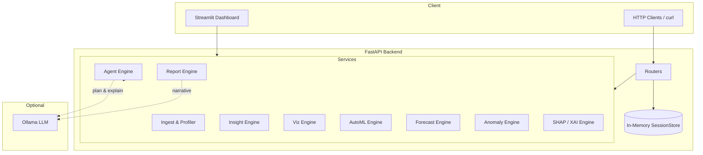

# Prisma AI

**An AI-Powered Analytics Copilot for Automated Insights, Forecasting, Explainability, and Conversational Data Analysis.**

[](https://www.python.org/)
[](https://fastapi.tiangolo.com/)
[](https://streamlit.io/)
[](https://scikit-learn.org/)
[](https://github.com/shap/shap)
[](backend/tests/)
[](LICENSE)

**Repository:** [github.com/Hypersb/Data-Pilot-AI](https://github.com/Hypersb/Data-Pilot-AI)

---

## 1. Overview

Prisma AI is a Python-based data analysis platform that turns uploaded **CSV or Excel** files into actionable analytics. Users get automated profiling, rule-based insights, interactive charts, model comparison (AutoML), time-series forecasting with backtesting, anomaly detection, SHAP-based explainability, executive reports, and a **tool-calling natural language analyst** — all exposed through a **FastAPI** backend and a **Streamlit** dashboard.

The project is designed for students, researchers, and early-career engineers who want a portfolio-ready system that demonstrates **real ML pipelines**, **API-first architecture**, and **responsible AI patterns** (grounded answers, no arbitrary code execution).

**What you can do in one session:**

- Upload a dataset and receive a quality profile within seconds
- Compare multiple ML models automatically
- Backtest forecast models and view a ranked leaderboard
- Detect outliers with several statistical and ML methods
- Ask questions in plain English and receive answers backed by computed tool output
- Export a markdown executive report

**Current scope (honest):** sessions are stored in memory (no database), there is no user authentication, and **Ollama is optional** for LLM-enhanced agent planning and report narratives. Core analytics and ML run without Ollama.

---

## 2. Features

| Capability | Description |
|------------|-------------|
| **Data profiling** | Row/column counts, inferred types, missing values, duplicate rows, quality score |
| **Insight engine** | Correlations, outliers, category performance, trends, growth patterns |
| **Visualization** | Auto-generated Plotly charts: line, bar, histogram, scatter, correlation heatmap |
| **AutoML** | Detects regression, classification, or forecasting; trains multiple models; returns a leaderboard |
| **Forecasting leaderboard** | Rolling-window backtest of ARIMA, Prophet, lag-based Linear Regression, and XGBoost; ranks by MAPE, RMSE, MAE |
| **Anomaly detection** | IQR, modified Z-score, Isolation Forest, optional time-series rolling z-score |
| **SHAP explainability** | Global and local feature importance for the AutoML best **tabular** model |
| **AI Data Analyst** | Eight registered tools; Pydantic-validated tool calling; grounded citations |
| **Executive reports** | Structured markdown report with optional Ollama narrative |
| **REST API** | Typed JSON endpoints for every major capability |

**Streamlit tabs:** Overview · Insights · Anomalies · Charts · Forecast · AutoML · Explainable AI · Report · AI Data Analyst

---

## 3. Architecture Diagram



**Design principles:**

- **API-first** — business logic lives in `backend/app/services/`; routers stay thin
- **Grounded AI** — the LLM selects tools and explains results; Python services compute statistics
- **Graceful degradation** — heuristic agent routing and template reports when Ollama is offline

See also: [docs/architecture.md](docs/architecture.md)

---

## 4. Tech Stack

| Layer | Technologies |
|-------|--------------|
| **UI** | Streamlit |
| **API** | FastAPI, Pydantic, Uvicorn |
| **Data** | Pandas, NumPy, openpyxl |
| **ML / Stats** | scikit-learn, statsmodels, XGBoost, Prophet |
| **Explainability** | SHAP |
| **Charts** | Plotly |
| **LLM (optional)** | Ollama via HTTP |
| **Testing** | pytest, pytest-asyncio |

---

## 5. Machine Learning Features

### AutoML

- Automatically detects **regression**, **classification**, or **forecasting** (datetime + numeric target)
- Trains candidate models (e.g. Linear Regression, Random Forest, XGBoost; ARIMA/Prophet for forecasting)
- Returns a **leaderboard** ranked on held-out metrics and a **best model** selection

### Forecasting Leaderboard

- Requires a datetime column and numeric target
- **Rolling-window backtesting** across four approaches:
  - ARIMA
  - Prophet
  - Linear Regression with time-lag features
  - XGBoost Regressor with time-lag features
- Evaluates **MAPE**, **RMSE**, and **MAE**
- Generates forward forecasts with confidence intervals when the selected model supports them

### Anomaly Detection

- **IQR** rule on numeric columns
- **Modified Z-score** (median + MAD)
- **Isolation Forest** for multivariate outliers
- **Time-series** rolling z-score when a datetime column is present
- Returns flagged rows, severity, methods used, and chart data

### SHAP Explainability

- Fits the AutoML best model on **tabular** regression or classification tasks
- Uses SHAP TreeExplainer or LinearExplainer
- Returns top features, global narrative, local row explanations, and Plotly charts

> **Note:** SHAP is not available when AutoML classifies the dataset as pure **forecasting** (datetime + numeric target only). Use a tabular dataset with feature columns for explainability demos.

---

## 6. AI Data Analyst Agent

The **AI Data Analyst** answers questions in plain English using a **tool-calling architecture**. The LLM does **not** execute arbitrary Python or compute statistics itself.

**Flow:** Question → `AgentPlan` (Pydantic) → tool execution → verified facts → optional LLM explanation

**Registered tools:**

| Tool | Purpose |
|------|---------|
| `summarize_dataset` | Profile overview and schema summary |
| `top_n_by_metric` | Rank categories by a numeric metric |
| `compare_segments` | Compare average performance across segments |
| `correlation_analysis` | Top correlations with a target column |
| `anomaly_explanation` | Explain detected unusual records |
| `forecast_metric` | Run the forecasting leaderboard |
| `model_explanation` | SHAP-based feature importance |
| `generate_business_recommendation` | Actionable recommendations from insight engine |

**Safety:** No `eval()`, no generated dataframe code — only validated tool calls with citation-backed responses.

**Example questions:**

- *"Which region generated the most revenue?"*
- *"Forecast next month's revenue."*
- *"Show me unusual records."*
- *"What variables influence profit most?"*

When Ollama is unavailable, the agent falls back to **keyword-based tool selection** and template answers — analytics still run through the same tools.

---

## 7. API Endpoints

Base URL (local): `http://127.0.0.1:8000` · Interactive docs: `/docs`

| Method | Endpoint | Description |
|--------|----------|-------------|
| `GET` | `/health` | Health check |
| `POST` | `/api/upload` | Upload CSV/Excel; returns `session_id` |
| `DELETE` | `/api/sessions/{session_id}` | Delete session |
| `GET` | `/api/sessions/{session_id}/profile` | Data profile |
| `GET` | `/api/sessions/{session_id}/insights` | Generated insights |
| `GET` | `/api/sessions/{session_id}/charts` | Plotly chart JSON |
| `GET` | `/api/sessions/{session_id}/forecast` | Forecasting leaderboard + forecast |
| `POST` | `/api/sessions/{session_id}/forecast` | Legacy compact forecast response |
| `POST` | `/api/sessions/{session_id}/automl` | AutoML leaderboard |
| `GET` | `/api/sessions/{session_id}/xai` | SHAP explanations |
| `GET` | `/api/sessions/{session_id}/anomalies` | Anomaly detection results |
| `POST` | `/api/sessions/{session_id}/chat` | AI Data Analyst (tool-calling agent) |
| `POST` | `/api/sessions/{session_id}/query` | Legacy NL query (agent-backed) |
| `GET` | `/api/sessions/{session_id}/report` | Executive markdown report |

**Example — chat**

```bash
curl -X POST "http://127.0.0.1:8000/api/sessions/{session_id}/chat" \
  -H "Content-Type: application/json" \
  -d '{"question": "Which region has the highest revenue?"}'
```

---

## 8. Installation

### Prerequisites

- Python 3.11+ (tested on 3.14)
- pip
- Optional: [Ollama](https://ollama.com/) for LLM-enhanced agent and reports

### Clone and install

```bash
git clone https://github.com/Hypersb/Data-Pilot-AI.git
cd Data-Pilot-AI/backend

python -m venv .venv

# Windows
.venv\Scripts\activate

# macOS / Linux
source .venv/bin/activate

pip install -r requirements.txt
```

### Optional — Ollama model

```bash
ollama pull llama3.2
```

If you use a different installed model, set `OLLAMA_MODEL` (e.g. `gemma3:4b`) before starting the app.

### Docker Compose

```bash
docker compose up -d
```

Starts backend, Streamlit, and Ollama containers (see `docker-compose.yml`).

---

## 9. Local Development

From the `backend/` directory:

**Streamlit dashboard (primary UI)**

```bash
streamlit run streamlit_app/main.py
```

Open **http://localhost:8501**

**FastAPI backend**

```bash
uvicorn app.main:app --reload --host 127.0.0.1 --port 8000
```

Open **http://127.0.0.1:8000/docs**

**Environment variables**

| Variable | Default | Description |
|----------|---------|-------------|
| `OLLAMA_BASE_URL` | `http://localhost:11434` | Ollama API URL |
| `OLLAMA_MODEL` | `llama3.2` | Model name for agent/report LLM calls |
| `SESSION_TTL_SECONDS` | `7200` | In-memory session expiry |
| `MAX_UPLOAD_MB` | `25` | Maximum upload size |
| `CORS_ORIGINS` | `http://localhost:8501` | Allowed CORS origins |

**Sample data:** upload `sample-data/sales.csv` (multi-region sales with date, region, product, revenue, units).

---

## 10. Running Tests

```bash
cd backend
python -m pytest tests/ -v
```

**Status: 73 automated tests passing**

| Module | Covers |
|--------|--------|
| `test_analytics.py` | Upload, profile, insights, charts |
| `test_api.py` | Full API integration flow |
| `test_automl.py` | Task detection, regression/classification/forecasting |
| `test_forecast.py` | Backtesting, leaderboard, forecast API |
| `test_anomaly.py` | IQR, Z-score, Isolation Forest, time-series |
| `test_xai.py` | SHAP explanations and forecasting fallback |
| `test_agent.py` | Tool selection, tools, chat API, edge cases |

---

## 11. Example Workflow

1. **Start** Streamlit and open http://localhost:8501
2. **Upload** `sample-data/sales.csv`
3. **Overview** — review quality score, column types, and completeness
4. **Insights** — read auto-generated correlation, trend, and category findings
5. **Charts** — explore Plotly visualizations
6. **Forecast** — run the forecasting leaderboard; compare MAPE / RMSE / MAE; view the best-model chart
7. **AutoML** — train models; inspect the leaderboard and best model
8. **Explainable AI** — run SHAP on a **tabular** dataset (feature columns + target); on pure time-series data, expect a graceful unavailable message
9. **Anomalies** — review flagged rows and severity
10. **AI Data Analyst** — ask *"Which region has the highest revenue?"* or *"Forecast next month's revenue"*
11. **Report** — generate and download the executive markdown summary

---

## 12. Screenshots

Screenshots can be added under `docs/assets/` before or after release:

| Tab | Suggested filename |
|-----|-------------------|
| Overview | `docs/assets/overview.png` |
| Forecast leaderboard | `docs/assets/forecast.png` |
| AI Data Analyst | `docs/assets/agent.png` |

Run Streamlit locally, capture the tabs above, and drop PNGs into `docs/assets/` to enable images in this section.

> **Note:** A legacy Next.js app under `frontend/` is not included in this repository. **Streamlit** (`backend/streamlit_app/`) is the maintained UI.

---

## 13. Future Improvements

- [ ] Persistent session storage (PostgreSQL or Redis)
- [ ] User authentication and multi-tenant sessions
- [ ] GitHub Actions CI with live pytest badge
- [ ] Cached ML artifacts per session
- [ ] Screenshot and demo GIF assets in README
- [ ] SHAP support for forecasting models (or clearer UI guidance)
- [ ] OpenAPI client examples (Python / TypeScript)

---

## 14. License

MIT License — see [LICENSE](LICENSE) for details.

---

## Additional Documentation

| Document | Description |
|----------|-------------|
| [Architecture](docs/architecture.md) | Data flow, ML pipelines, agent safety design |
| [Demo script](docs/demo_script.md) | 2-minute and 5-minute presentation scripts |
| [Resume bullets](docs/resume_bullets.md) | Role-targeted project bullets |
| [Project evaluation](docs/project_evaluation.md) | Recruiter-facing strengths and scope |
