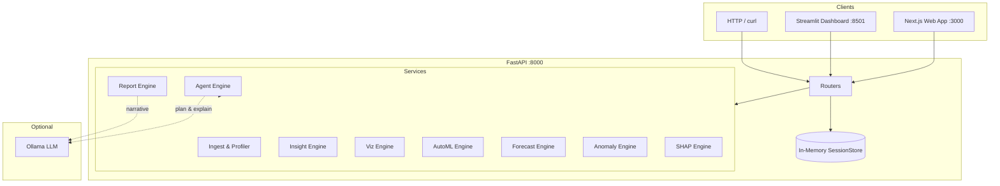

# Prisma AI

<p align="center">
  
</p>

<p align="center">
  <strong>AI analytics copilot for CSV and Excel — profile, forecast, explain, and ask in plain English.</strong>
</p>

<p align="center">
  Built by Subhanjan · MIT License
</p>

<p align="center">
  <a href="https://github.com/Hypersb/Data-Pilot-AI">github.com/Hypersb/Data-Pilot-AI</a>
</p>

[](https://www.python.org/)
[](https://fastapi.tiangolo.com/)
[](https://nextjs.org/)
[](https://streamlit.io/)
[](https://scikit-learn.org/)
[](https://github.com/shap/shap)
[](backend/tests/)
[](LICENSE)

---

## Quick start

Run all three services locally (three terminals):

**Terminal 1 — Backend**

```bash
cd backend
python -m venv .venv
.venv\Scripts\activate          # Windows
# source .venv/bin/activate     # macOS / Linux
pip install -r requirements.txt
uvicorn app.main:app --reload --host 127.0.0.1 --port 8000
```

**Terminal 2 — Web app (primary UI)**

```bash
cd frontend
cp .env.local.example .env.local
npm install
npm run dev
```

**Terminal 3 — Streamlit (optional dashboard)**

```bash
cd backend
streamlit run streamlit_app/main.py --server.port 8501
```

| Service | URL |
|---------|-----|
| **Web app** | http://localhost:3000 |
| **API + Swagger** | http://127.0.0.1:8000/docs |
| **Streamlit** | http://localhost:8501 |

Try it: open the web app → **Upload file** or **Try sample dataset** → ask *"Summarize this dataset"* in chat.

Sample file: [`sample-data/sales.csv`](sample-data/sales.csv)

---

## Overview

Prisma AI turns uploaded **CSV or Excel** files into actionable analytics in one session. Upload a file, ask questions in natural language, and get answers **grounded in computed output** — not hallucinated numbers.

**What you get:**

- Automated data profiling and quality scoring
- Rule-based insights (correlations, trends, category performance)
- AutoML model comparison with leaderboards
- Time-series forecasting with rolling-window backtests
- Anomaly detection (statistical + ML methods)
- SHAP explainability for tabular models
- Conversational analyst with eight registered tools and citations
- Executive markdown reports (optional LLM narrative)

**Honest scope:** sessions live in memory (no database), there is no authentication, and **Ollama is optional**. Core analytics and ML run without any LLM installed.

---

## Web app

The **Next.js** frontend is the primary product UI — conversation-first, with analysis views in the sidebar.

### Routes

| Route | Purpose |
|-------|---------|
| `/` | Landing page — Everest-themed hero, ask a question or upload |
| `/upload` | Drag-and-drop CSV/Excel upload; sample dataset button |
| `/analyze/{sessionId}/chat` | AI analyst chat with suggestion chips and inline evidence |
| `/analyze/{sessionId}/data` | Dataset overview — rows, quality, insights |
| `/analyze/{sessionId}/forecast` | Forecast leaderboard + chart |
| `/analyze/{sessionId}/explain` | Feature drivers (SHAP) |
| `/analyze/{sessionId}/models` | AutoML model comparison |

### Frontend stack

- **Next.js 16** (App Router) · **React 19** · **TypeScript**
- **Tailwind CSS 4** · **Plotly** charts · **react-dropzone**

### Environment

Create `frontend/.env.local`:

```env
NEXT_PUBLIC_API_URL=http://localhost:8000
```

Production build:

```bash
cd frontend
npm run build
npm start
```

---

## Features

| Capability | Description |
|------------|-------------|
| **Data profiling** | Row/column counts, types, missing values, duplicates, quality score |
| **Insight engine** | Correlations, outliers, category performance, trends |
| **Visualization** | Plotly charts: line, bar, histogram, scatter, heatmap |
| **AutoML** | Regression, classification, or forecasting detection; model leaderboard |
| **Forecasting** | Backtest ARIMA, Prophet, lag-LR, XGBoost; rank by MAPE / RMSE / MAE |
| **Anomaly detection** | IQR, modified Z-score, Isolation Forest, time-series z-score |
| **SHAP explainability** | Global + local importance for tabular AutoML best model |
| **AI Data Analyst** | Eight tools, Pydantic-validated calls, citation-backed answers |
| **Executive reports** | Structured markdown; optional Ollama narrative |
| **REST API** | Typed JSON endpoints for every capability |

**Streamlit tabs** (optional): Overview · Insights · Anomalies · Charts · Forecast · AutoML · Explainable AI · Report · AI Data Analyst

---

## Architecture



**Design principles**

- **API-first** — logic in `backend/app/services/`; routers stay thin
- **Grounded AI** — LLM selects tools and explains; Python computes statistics
- **No arbitrary code execution** — only eight registered, validated tools
- **Graceful degradation** — keyword routing + template answers when Ollama is offline

See [docs/architecture.md](docs/architecture.md) for full detail.

---

## Project structure

```
Data-Pilot-AI/
├── assets/logo.png              # Brand logo
├── backend/
│   ├── app/
│   │   ├── main.py              # FastAPI entry
│   │   ├── config.py            # Settings & CORS
│   │   ├── routers/             # API routes
│   │   └── services/            # ML, agent, analytics engines
│   ├── streamlit_app/           # Optional Streamlit UI
│   ├── tests/                   # 73 pytest tests
│   └── requirements.txt
├── frontend/
│   ├── src/app/                 # Next.js pages
│   ├── src/components/          # UI components
│   ├── public/sample/           # Sample CSV for one-click demo
│   └── package.json
├── sample-data/sales.csv        # Demo dataset
├── docs/                        # Architecture, demo script, resume bullets
└── docker-compose.yml
```

---

## Tech stack

| Layer | Technologies |
|-------|--------------|
| **Web UI** | Next.js 16, React 19, Tailwind CSS 4, Plotly |
| **Dashboard UI** | Streamlit |
| **API** | FastAPI, Pydantic, Uvicorn |
| **Data** | Pandas, NumPy, openpyxl |
| **ML / Stats** | scikit-learn, statsmodels, XGBoost, Prophet |
| **Explainability** | SHAP |
| **Charts** | Plotly |
| **LLM (optional)** | Ollama via HTTP |
| **Testing** | pytest, pytest-asyncio |

---

## Machine learning

### AutoML

Detects **regression**, **classification**, or **forecasting** tasks. Trains candidate models (Linear Regression, Random Forest, XGBoost; ARIMA/Prophet for time series). Returns a ranked **leaderboard** and best model.

### Forecasting leaderboard

Requires a datetime column and numeric target. Rolling-window backtest across:

- ARIMA · Prophet · Linear Regression (lag features) · XGBoost (lag features)

Ranked by **MAPE**, **RMSE**, **MAE**. Forward forecasts with confidence intervals when supported.

### Anomaly detection

IQR · modified Z-score · Isolation Forest · rolling z-score (time series). Returns flagged rows, severity, and chart data.

### SHAP explainability

Fits the AutoML best **tabular** model. TreeExplainer or LinearExplainer. Global narrative, local row explanations, Plotly charts.

> SHAP is unavailable for pure forecasting datasets (datetime + target only). Use tabular data with feature columns for driver analysis.

---

## AI Data Analyst

Answers questions in plain English via **tool calling**. The LLM never executes arbitrary Python.

**Flow:** Question → `AgentPlan` (Pydantic) → tool execution → verified facts → explanation

| Tool | Purpose |
|------|---------|
| `summarize_dataset` | Profile and schema summary |
| `top_n_by_metric` | Rank categories by a metric |
| `compare_segments` | Compare averages across segments |
| `correlation_analysis` | Top correlations with a target |
| `anomaly_explanation` | Explain unusual records |
| `forecast_metric` | Run forecasting leaderboard |
| `model_explanation` | SHAP feature importance |
| `generate_business_recommendation` | Actionable recommendations |

**Example questions**

- *"Which region generated the most revenue?"*
- *"What trends stand out?"*
- *"Forecast next quarter."*
- *"What drives profit most?"*

Without Ollama, the agent uses **keyword-based tool selection** — same tools, template phrasing.

---

## API reference

Base URL: `http://127.0.0.1:8000` · Interactive docs: `/docs`

| Method | Endpoint | Description |
|--------|----------|-------------|
| `GET` | `/health` | Health check |
| `POST` | `/api/upload` | Upload CSV/Excel → `session_id` |
| `DELETE` | `/api/sessions/{session_id}` | Delete session |
| `GET` | `/api/sessions/{session_id}/profile` | Data profile |
| `GET` | `/api/sessions/{session_id}/insights` | Generated insights |
| `GET` | `/api/sessions/{session_id}/charts` | Plotly chart JSON |
| `GET` | `/api/sessions/{session_id}/forecast` | Forecast leaderboard |
| `POST` | `/api/sessions/{session_id}/automl` | AutoML leaderboard |
| `GET` | `/api/sessions/{session_id}/xai` | SHAP explanations |
| `GET` | `/api/sessions/{session_id}/anomalies` | Anomaly results |
| `POST` | `/api/sessions/{session_id}/chat` | AI Data Analyst |
| `GET` | `/api/sessions/{session_id}/report` | Executive markdown report |

**Example — chat**

```bash
curl -X POST "http://127.0.0.1:8000/api/sessions/{session_id}/chat" \
  -H "Content-Type: application/json" \
  -d '{"question": "Which region has the highest revenue?"}'
```

---

## Installation

### Prerequisites

- Python 3.11+ (tested on 3.14)
- Node.js 20+
- pip
- Optional: [Ollama](https://ollama.com/) for LLM-enhanced agent and reports

### Backend

```bash
git clone https://github.com/Hypersb/Data-Pilot-AI.git
cd Data-Pilot-AI/backend
python -m venv .venv
.venv\Scripts\activate          # Windows
pip install -r requirements.txt
```

### Frontend

```bash
cd ../frontend
npm install
cp .env.local.example .env.local
```

### Optional — Ollama

```bash
ollama pull llama3.2
# or: ollama pull gemma3:4b
```

Set the model before starting:

```bash
# Windows PowerShell
$env:OLLAMA_MODEL="gemma3:4b"

# macOS / Linux
export OLLAMA_MODEL=gemma3:4b
```

### Docker Compose

```bash
docker compose up -d
```

Starts backend, Streamlit, and Ollama (see `docker-compose.yml`).

---

## Environment variables

| Variable | Default | Description |
|----------|---------|-------------|
| `NEXT_PUBLIC_API_URL` | `http://localhost:8000` | Frontend → API base URL |
| `OLLAMA_BASE_URL` | `http://localhost:11434` | Ollama API URL |
| `OLLAMA_MODEL` | `llama3.2` | Model for agent / reports |
| `SESSION_TTL_SECONDS` | `7200` | Session expiry (seconds) |
| `MAX_UPLOAD_MB` | `25` | Max upload size |
| `CORS_ORIGINS` | `http://localhost:8501,http://localhost:3000` | Allowed origins |

---

## Example workflow (web app)

1. Start backend + frontend (see [Quick start](#quick-start))
2. Open **http://localhost:3000**
3. Type a question or click **Upload file**
4. Upload `sample-data/sales.csv` (or use **Try sample dataset** on `/upload`)
5. **Chat** — ask *"Which region has the highest revenue?"* or *"Summarize this dataset"*
6. **Overview** — quality score, row counts, auto insights
7. **Forecast** — backtested leaderboard + chart
8. **Drivers** — SHAP feature importance (tabular datasets)
9. **Models** — AutoML comparison table

---

## Example workflow (Streamlit)

1. Start backend + Streamlit
2. Open **http://localhost:8501**
3. Upload `sample-data/sales.csv`
4. Walk tabs: Overview → Insights → Charts → Forecast → AutoML → Explainable AI → Anomalies → AI Data Analyst → Report

---

## Running tests

```bash
cd backend
python -m pytest tests/ -v
```

**73 automated tests passing**

| Module | Covers |
|--------|--------|
| `test_analytics.py` | Upload, profile, insights, charts |
| `test_api.py` | Full API integration |
| `test_automl.py` | Task detection, regression/classification/forecasting |
| `test_forecast.py` | Backtesting, leaderboard, forecast API |
| `test_anomaly.py` | IQR, Z-score, Isolation Forest, time-series |
| `test_xai.py` | SHAP and forecasting fallback |
| `test_agent.py` | Tool selection, chat API, edge cases |

---

## Screenshots

Add captures under `docs/assets/` for your README or portfolio:

| View | Suggested filename |
|------|-------------------|
| Landing | `docs/assets/landing.png` |
| Chat | `docs/assets/chat.png` |
| Forecast | `docs/assets/forecast.png` |
| Streamlit overview | `docs/assets/streamlit-overview.png` |

---

## Roadmap

- [ ] Persistent sessions (PostgreSQL or Redis)
- [ ] User authentication and multi-tenant workspaces
- [ ] GitHub Actions CI with live pytest badge
- [ ] Cached ML artifacts per session
- [ ] Demo GIF in README
- [ ] OpenAPI TypeScript client generation

---

## License

MIT — see [LICENSE](LICENSE).

---

## Additional documentation

| Document | Description |
|----------|-------------|
| [Architecture](docs/architecture.md) | Data flow, ML pipelines, agent safety |
| [Demo script](docs/demo_script.md) | 2- and 5-minute presentation scripts |
| [Resume bullets](docs/resume_bullets.md) | Role-targeted project bullets |
| [Project evaluation](docs/project_evaluation.md) | Recruiter-facing strengths and scope |

---

<p align="center">
  <sub>Prisma AI · From Nepal to your spreadsheet</sub>
</p>
