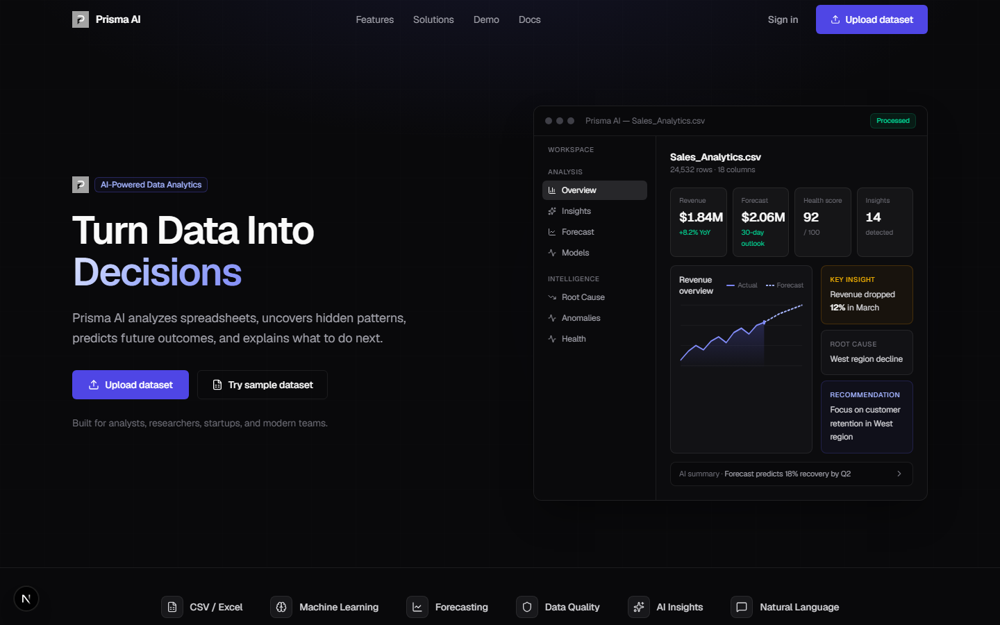
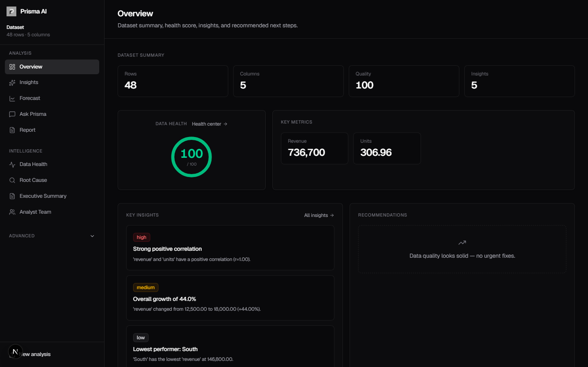
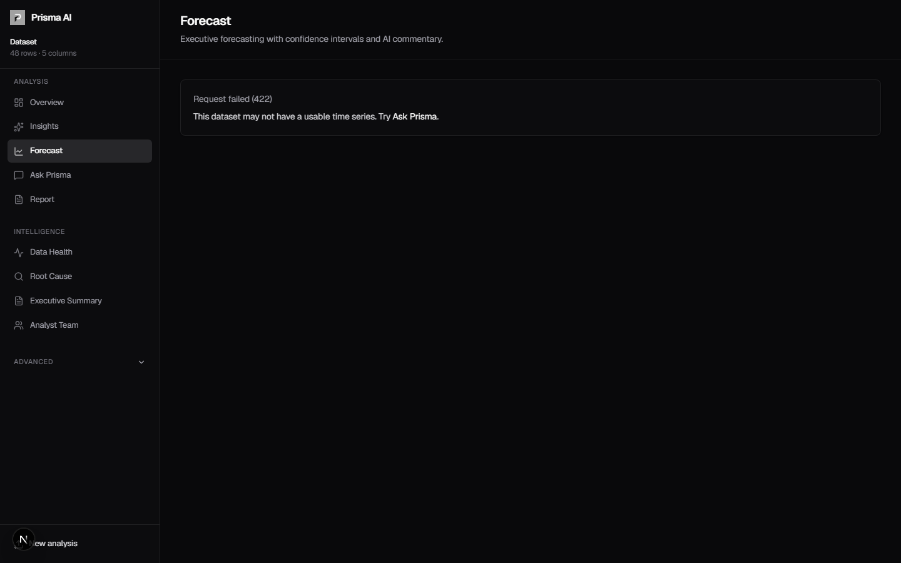
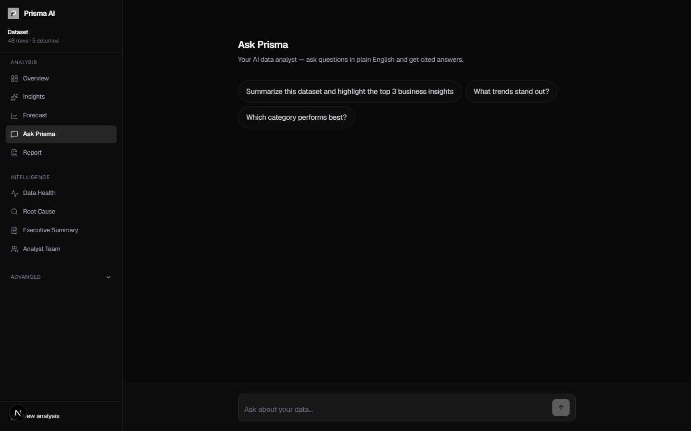
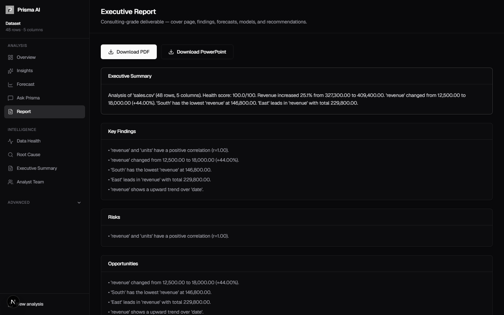
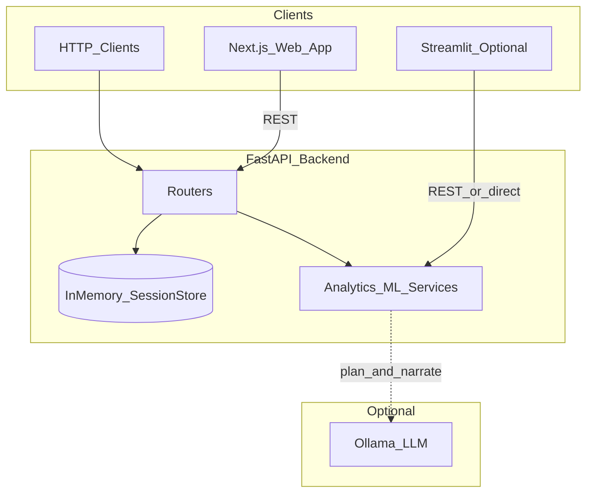

# Prisma AI

<p align="center">
  
</p>

<p align="center">
  <strong>Turn data into decisions — upload a spreadsheet, get insights, forecasts, and grounded answers.</strong>
</p>

<p align="center">
  Built by Subhanjan · MIT License
</p>

<p align="center">
  <a href="https://github.com/Hypersb/Data-Pilot-AI">github.com/Hypersb/Data-Pilot-AI</a>
</p>

[](https://github.com/Hypersb/Data-Pilot-AI/actions/workflows/ci.yml)
[](CHANGELOG.md)
[](https://www.python.org/)
[](https://fastapi.tiangolo.com/)
[](https://nextjs.org/)
[](https://scikit-learn.org/)
[](backend/tests/)
[](LICENSE)

> **Live demo:** Deploy the frontend to [Vercel](https://vercel.com) and API to [Render](https://render.com) — see [docs/DEPLOY.md](docs/DEPLOY.md). Set `NEXT_PUBLIC_API_URL` to your API URL.

---

## Product overview

Prisma AI is an **open-source AI data analyst platform**. Upload CSV or Excel and get automatic EDA, statistical insights, forecasting, natural-language Q&A, and a PDF executive report — all grounded in Python computations, not hallucinated numbers.

**Core workflow:** Upload → Overview → Insights → Forecast → Chat → Report

| Step | What happens |
|------|----------------|
| Upload | CSV/Excel ingest with type inference and session creation |
| Overview | Profile, KPIs, quality score, top insights, chart preview |
| Insights | Correlations, trends, outliers, segment performance |
| Forecast | ARIMA, Prophet, XGBoost leaderboard with backtesting |
| Chat | Tool-calling agent with citations (Ollama optional) |
| Report | Markdown or PDF executive summary |

**Honest scope for v3.0.0-rc.1:** sessions live in memory (no database), there is no authentication, and **Ollama is optional**. Core analytics and ML run without any LLM installed.

---

## Screenshots

<p align="center">
  
</p>

| Overview | Forecast | Chat |
|:--:|:--:|:--:|
|  |  |  |

<p align="center">
  
</p>

### Product demo

Upload → Overview → Ask Prisma → Executive Report in under 60 seconds with a sample dataset. See [docs/v3-demo-script.md](docs/v3-demo-script.md) for a timed walkthrough.

---

## Why Prisma AI

| Typical analytics demo | Prisma AI |
|------------------------|-----------|
| Single Jupyter notebook | Modular Python services + REST API + Next.js UI |
| One hard-coded model | AutoML + forecast leaderboards with backtesting |
| “Chat with data” via pandas exec | **Tool-calling agent** — no arbitrary code execution |
| README install steps only | Architecture docs, demo scripts, CI, governance files |

**Design principles**

- **API-first** — logic in `backend/app/services/`; routers stay thin
- **Grounded AI** — LLM selects tools and explains; Python computes statistics
- **Graceful degradation** — keyword routing + template answers when Ollama is offline

---

## Features

| Capability | Description |
|------------|-------------|
| **Data profiling** | Row/column counts, types, missing values, duplicates, quality score |
| **Insight engine** | Correlations, outliers, category performance, trends |
| **Visualization** | Plotly charts: line, bar, histogram, scatter, heatmap |
| **Dashboard** | KPIs, panels, quality alerts, embedded charts |
| **AutoML** | Regression, classification, or forecasting detection; model leaderboard |
| **Model Arena** | Compare Linear, Random Forest, XGBoost, LightGBM on tabular tasks |
| **Forecasting** | Backtest ARIMA, Prophet, lag-LR, XGBoost; rank by MAPE / RMSE / MAE |
| **Anomaly detection** | IQR, modified Z-score, Isolation Forest, time-series z-score |
| **SHAP explainability** | Global + local importance for tabular AutoML best model |
| **AI Data Analyst** | Eight tools, Pydantic-validated calls, citation-backed answers |
| **Executive reports** | Markdown, PDF, or PPTX export |
| **Advanced** | Root cause, storytelling, team analysis, NL cleaning, SQL generation, experiment lab |
| **Sample datasets** | One-click demo loads from `sample-data/` |
| **REST API** | Typed JSON endpoints; interactive docs at `/docs` |

---

## Architecture



See [docs/architecture.md](docs/architecture.md) for full detail.

---

## Technology stack

| Layer | Technologies |
|-------|--------------|
| **Web UI** | Next.js 16, React 19, Tailwind CSS 4, Plotly |
| **Optional UI** | Streamlit |
| **API** | FastAPI, Pydantic, Uvicorn |
| **Data** | Pandas, NumPy, openpyxl |
| **ML / Stats** | scikit-learn, statsmodels, XGBoost, LightGBM, Prophet |
| **Explainability** | SHAP |
| **Reports** | ReportLab, python-pptx |
| **LLM (optional)** | Ollama via HTTP |
| **Testing** | pytest, pytest-asyncio |
| **CI** | GitHub Actions |

---

## Installation

### Prerequisites

- Python 3.11+ (tested on 3.12–3.14)
- Node.js 20+
- pip and npm
- Optional: [Ollama](https://ollama.com/) for LLM-enhanced chat and reports

### Clone

```bash
git clone https://github.com/Hypersb/Data-Pilot-AI.git
cd Data-Pilot-AI
```

### Backend

```bash
cd backend
python -m venv .venv
# Windows: .venv\Scripts\activate
# macOS/Linux: source .venv/bin/activate
pip install -r requirements.txt
cp .env.example .env   # optional local overrides
```

### Frontend

```bash
cd frontend
npm install
cp .env.local.example .env.local
```

---

## Quick start

**Windows (recommended):**

```powershell
.\scripts\start-dev.ps1
```

**macOS / Linux:**

```bash
chmod +x scripts/start-dev.sh
./scripts/start-dev.sh
```

**Manual (two terminals):**

```bash
# Terminal 1 — Backend on :8080
cd backend
python -m uvicorn app.main:app --reload --host 127.0.0.1 --port 8080

# Terminal 2 — Frontend on :3000
cd frontend
npm run dev
```

| Service | URL |
|---------|-----|
| **Web app** | http://localhost:3000 |
| **API + Swagger** | http://127.0.0.1:8080/docs |
| **Health check** | http://127.0.0.1:8080/health |

---

## Demo

**Recommended 3-minute walkthrough:** [docs/v3-demo-script.md](docs/v3-demo-script.md)

1. Open http://localhost:3000
2. Click **Try sample dataset** or upload `sample-data/sales.csv`
3. Walk **Overview → Insights → Forecast → Chat → Report (PDF)**

Optional Streamlit dashboard: [docs/streamlit-demo-script.md](docs/streamlit-demo-script.md)

---

## API

Base URL: `http://127.0.0.1:8080` · Interactive docs: `/docs` · API version: `3.0.0`

### Core endpoints

| Method | Endpoint | Description |
|--------|----------|-------------|
| `GET` | `/health` | Health check |
| `POST` | `/api/upload` | Upload CSV/Excel → `session_id` |
| `DELETE` | `/api/sessions/{id}` | Delete session |
| `GET` | `/api/samples` | List sample datasets |
| `POST` | `/api/samples/{id}/load` | Load sample into session |
| `GET` | `/api/sessions/{id}/analysis` | V3 analysis bundle (profile, insights, dashboard, forecast) |
| `GET` | `/api/sessions/{id}/profile` | Data profile |
| `GET` | `/api/sessions/{id}/insights` | Generated insights |
| `GET` | `/api/sessions/{id}/charts` | Plotly chart JSON |
| `GET` | `/api/sessions/{id}/dashboard` | Dashboard KPIs and panels |
| `GET` | `/api/sessions/{id}/health` | Data health score |
| `GET` | `/api/sessions/{id}/forecast` | Forecast leaderboard |
| `POST` | `/api/sessions/{id}/chat` | AI Data Analyst |
| `GET` | `/api/sessions/{id}/report/v2` | Executive report (markdown, PDF, pptx) |

### ML and advanced

| Method | Endpoint | Description |
|--------|----------|-------------|
| `POST` | `/api/sessions/{id}/automl` | AutoML leaderboard |
| `GET/POST` | `/api/sessions/{id}/models` | Model Arena comparison |
| `GET` | `/api/sessions/{id}/xai` | SHAP explanations |
| `GET` | `/api/sessions/{id}/anomalies` | Anomaly detection |
| `POST` | `/api/sessions/{id}/root-cause` | Root cause analysis |
| `POST` | `/api/sessions/{id}/team-analysis` | Multi-agent team report |
| `POST` | `/api/sessions/{id}/clean` | NL data cleaning |
| `POST` | `/api/sessions/{id}/sql` | SQL generation (non-executing) |
| `GET` | `/api/sessions/{id}/experiments/lab` | Experiment Lab |

**Example — chat**

```bash
curl -X POST "http://127.0.0.1:8080/api/sessions/{session_id}/chat" \
  -H "Content-Type: application/json" \
  -d '{"question": "Which region has the highest revenue?"}'
```

---

## Machine learning pipeline

### AutoML

Detects **regression**, **classification**, or **forecasting** tasks. Trains candidate models (Linear Regression, Random Forest, XGBoost; ARIMA/Prophet for time series). Returns a ranked **leaderboard** and best model.

### Forecasting leaderboard

Requires a datetime column and numeric target. Rolling-window backtest across:

- ARIMA · Prophet · Linear Regression (lag features) · XGBoost (lag features)

Ranked by **MAPE**, **RMSE**, **MAE**. Forward forecasts with confidence intervals when supported.

### Anomaly detection

IQR · modified Z-score · Isolation Forest · rolling z-score (time series). Returns flagged rows, severity, and chart data.

### SHAP explainability

Fits the AutoML best **tabular** model. TreeExplainer or LinearExplainer. Global narrative, local row explanations, Plotly charts.

> SHAP is unavailable for pure forecasting datasets (datetime + target only). Use tabular data with feature columns for driver analysis.

### AI Data Analyst (8 tools)

| Tool | Purpose |
|------|---------|
| `summarize_dataset` | Profile and schema summary |
| `top_n_by_metric` | Rank categories by a metric |
| `compare_segments` | Compare averages across segments |
| `correlation_analysis` | Top correlations with a target |
| `anomaly_explanation` | Explain unusual records |
| `forecast_metric` | Run forecasting leaderboard |
| `model_explanation` | SHAP feature importance |
| `generate_business_recommendation` | Actionable recommendations |

Without Ollama, the agent uses **keyword-based tool selection** — same tools, template phrasing.

---

## Project structure

```
Data-Pilot-AI/
├── assets/                    # Brand logo and social preview
├── backend/
│   ├── app/
│   │   ├── main.py            # FastAPI entry
│   │   ├── config.py          # Settings & CORS
│   │   ├── routers/           # API routes
│   │   ├── services/          # ML, agent, analytics engines
│   │   └── agents/            # Multi-agent team analysis
│   ├── streamlit_app/         # Optional Streamlit UI
│   ├── tests/                 # pytest suite (97 tests)
│   ├── Dockerfile
│   └── requirements.txt
├── frontend/
│   ├── src/app/               # Next.js App Router pages
│   ├── src/components/        # UI components
│   └── public/brand/            # Favicon and mark
├── sample-data/               # Demo CSV datasets
├── docs/                      # Architecture, demo scripts, assets
├── scripts/                   # Dev startup scripts
├── .github/workflows/         # CI
├── docker-compose.yml
├── CHANGELOG.md
├── CONTRIBUTING.md
├── SECURITY.md
└── CODE_OF_CONDUCT.md
```

---

## Environment variables

| Variable | Default | Description |
|----------|---------|-------------|
| `NEXT_PUBLIC_API_URL` | `http://127.0.0.1:8080` | Frontend → API base URL |
| `NEXT_PUBLIC_SITE_URL` | `http://localhost:3000` | Canonical URL for OG metadata |
| `CORS_ORIGINS` | localhost origins | Allowed browser origins |
| `OLLAMA_BASE_URL` | `http://localhost:11434` | Ollama API URL |
| `OLLAMA_MODEL` | `llama3.2` | Model for agent / reports |
| `SESSION_TTL_SECONDS` | `7200` | Session expiry (seconds) |
| `MAX_UPLOAD_MB` | `25` | Max upload size |
| `SAMPLES_DIR` | repo `sample-data/` | Sample dataset directory |

See [backend/.env.example](backend/.env.example) and [frontend/.env.local.example](frontend/.env.local.example).

---

## Docker

```bash
docker compose up -d --build
```

| Service | URL |
|---------|-----|
| API | http://localhost:8000 |
| Streamlit (optional) | http://localhost:8501 |

Set `NEXT_PUBLIC_API_URL=http://localhost:8000` when using Docker with the Next.js frontend locally.

---

## Running tests

```bash
cd backend
python -m pytest tests/ -v
```

```bash
cd frontend
npm run build
npm run lint
```

**97 automated tests** covering API integration, ML engines, agent routing, and export flows.

---

## Roadmap

- [ ] Live demo URL (Vercel + hosted API)
- [ ] Persistent sessions (PostgreSQL or Redis)
- [ ] User authentication and multi-tenant workspaces
- [ ] Cached ML artifacts per session
- [ ] Demo GIF in README
- [ ] OpenAPI TypeScript client generation

---

## Documentation

| Document | Description |
|----------|-------------|
| [Architecture](docs/architecture.md) | Data flow, ML pipelines, agent safety |
| [V3 demo script](docs/v3-demo-script.md) | 3-minute Next.js walkthrough |
| [Streamlit demo script](docs/streamlit-demo-script.md) | Optional dashboard walkthrough |
| [Project evaluation](docs/project_evaluation.md) | Recruiter-facing strengths and scope |
| [Resume bullets](docs/resume_bullets.md) | Role-targeted project bullets |
| [CHANGELOG](CHANGELOG.md) | Release history |
| [Contributing](CONTRIBUTING.md) | How to contribute |
| [Security](SECURITY.md) | Vulnerability reporting |
| [Code of Conduct](CODE_OF_CONDUCT.md) | Community standards |

---

## Contributing

Contributions are welcome. Please read [CONTRIBUTING.md](CONTRIBUTING.md) and [CODE_OF_CONDUCT.md](CODE_OF_CONDUCT.md) before opening a pull request.

---

## License

MIT — see [LICENSE](LICENSE). Copyright (c) 2026 Hypersb.

---

<p align="center">
  <sub>Prisma AI · v3.0.0-rc.1 · <a href="https://github.com/Hypersb/Data-Pilot-AI">View on GitHub</a></sub>
</p>
