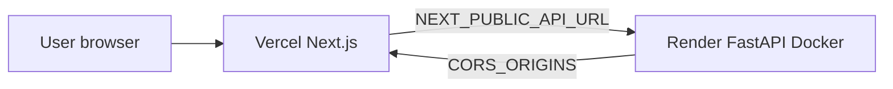

# Prisma AI — Deployment Guide

Production split: **Vercel (frontend)** + **Render (backend)**. No Ollama, no localhost, no manual hacks required after env vars are set.

See also: [ARCHITECTURE_V4.md](ARCHITECTURE_V4.md) · [DEPLOY.md](DEPLOY.md) (quick reference)

---

## Architecture



| Component | Platform | Directory |
|-----------|----------|-----------|
| Web UI | Vercel | `frontend/` |
| REST API | Render (Docker) | `backend/Dockerfile` |
| Database | Supabase (future) | — |

---

## One-time setup checklist

### 1. GitHub

1. Push this repo to GitHub.
2. Enable **Settings → General → Pull Requests → Automatically delete head branches**.
3. **Branch protection** on `main` (recommended):
   - Require status checks: `backend`, `frontend`, `docker`
   - Do **not** require pull request reviews if you are solo (allows direct push when CI is green).
4. CI runs on every push/PR via [.github/workflows/ci.yml](../.github/workflows/ci.yml).

### 2. Render (backend)

1. [Render Dashboard](https://dashboard.render.com) → **New → Blueprint** (or Web Service).
2. Connect the GitHub repo — Render reads [`render.yaml`](../render.yaml).
3. **Only** `prisma-ai-api` is deployed (Streamlit is not deployed).
4. Set **required** secret env var:
   - `CORS_ORIGINS` = your Vercel production URL(s), comma-separated  
     Example: `https://data-pilot-ai.vercel.app`
5. Deploy. Note the service URL, e.g. `https://prisma-ai-api.onrender.com`.
6. Verify: `GET https://<your-api>/health` → `{"status":"ok",...}`

**Render auto-sets `PORT`** — the Dockerfile uses `${PORT:-8000}`.

### 3. Vercel (frontend)

1. [Vercel](https://vercel.com) → **Add New Project** → import GitHub repo.
2. **Root Directory:** `frontend`
3. Framework: Next.js (auto-detected; [`vercel.json`](../frontend/vercel.json) pins install/build).
4. **Environment variables** (Production + Preview):

| Variable | Example | Required |
|----------|---------|----------|
| `NEXT_PUBLIC_API_URL` | `https://prisma-ai-api.onrender.com` | **Yes** |
| `NEXT_PUBLIC_SITE_URL` | `https://your-app.vercel.app` | Recommended |

5. Deploy.

### 4. Wire CORS

After Vercel deploy, ensure Render `CORS_ORIGINS` includes the exact Vercel origin (scheme + host, no trailing slash).

---

## Environment variables

### Backend (Render / `backend/.env`)

| Variable | Default | Description |
|----------|---------|-------------|
| `CORS_ORIGINS` | localhost (dev) | **Required in prod** — comma-separated allowed origins |
| `LLM_PROVIDER` | `none` | `none` \| `ollama` — analytics never require LLM |
| `OLLAMA_ENABLED` | `false` | Legacy alias; enables Ollama if `LLM_PROVIDER=none` |
| `OLLAMA_BASE_URL` | — | Only when using Ollama |
| `OLLAMA_MODEL` | `llama3.2` | Ollama model name |
| `OLLAMA_TIMEOUT` | `30` | Generate timeout (seconds) |
| `OLLAMA_CONNECT_TIMEOUT` | `5` | Connect timeout (seconds) |
| `SESSION_TTL_SECONDS` | `7200` | In-memory session TTL |
| `MAX_UPLOAD_MB` | `25` | Max upload size |
| `SAMPLES_DIR` | `/sample-data` | Bundled sample CSVs in Docker |
| `RATE_LIMIT_ENABLED` | `false` | Upload rate limit (single instance) |
| `RATE_LIMIT_UPLOADS_PER_MINUTE` | `10` | Uploads per IP per minute |
| `PORT` | `8000` | Set by Render automatically |

Template: [`backend/.env.example`](../backend/.env.example)

### Frontend (Vercel / `frontend/.env.local`)

| Variable | Default (dev) | Description |
|----------|---------------|-------------|
| `NEXT_PUBLIC_API_URL` | `http://127.0.0.1:8080` | **Required in production** — Render API URL |
| `NEXT_PUBLIC_SITE_URL` | `http://localhost:3000` | Canonical URL for metadata |

Template: [`frontend/.env.local.example`](../frontend/.env.local.example)

---

## Local development

**Windows:**

```powershell
.\scripts\start-dev.ps1
```

**macOS / Linux:**

```bash
./scripts/start-dev.sh
```

| Service | URL |
|---------|-----|
| Frontend | http://localhost:3000 |
| API | http://127.0.0.1:8080 |
| API docs | http://127.0.0.1:8080/docs |

```bash
cp backend/.env.example backend/.env          # optional
cp frontend/.env.local.example frontend/.env.local
```

**Docker (API only, no Ollama):**

```bash
docker compose up --build
# API: http://localhost:8000
```

Optional Ollama: `docker compose --profile llm up`

---

## Production validation

After deploy, verify:

- [ ] `GET /health` returns `status: ok` and `llm_provider: none`
- [ ] `GET /docs` loads OpenAPI UI
- [ ] Vercel landing page loads
- [ ] Upload sample CSV end-to-end
- [ ] Dashboard, Forecast, Explain (SHAP), Executive Report work
- [ ] No CORS errors in browser DevTools
- [ ] Chat works with template answers (no LLM required)

---

## Troubleshooting

| Symptom | Fix |
|---------|-----|
| CORS error in browser | Set `CORS_ORIGINS` on Render to exact Vercel URL |
| Frontend can't reach API | Set `NEXT_PUBLIC_API_URL` on Vercel; redeploy |
| Build fails on Vercel | Ensure root dir is `frontend`; check build logs |
| Render cold start slow | Normal on free tier; ML workloads need warm instance |
| Session lost after refresh | In-memory sessions reset on Render restart — expected until Supabase |
| `npm ci` fails on Vercel | Repo uses `npm install` in `vercel.json` (cross-platform lockfile) |
| CI `docker` job fails | Ensure Docker health check passes locally: `docker build -f backend/Dockerfile .` |

---

## GitHub workflows

| Workflow | Trigger | Purpose |
|----------|---------|---------|
| `ci.yml` | push/PR to `main` | backend tests, frontend lint+build, Docker health |
| `release.yml` | tag `v*` | validate + GitHub Release notes |
| Dependabot | weekly | pip, npm, GitHub Actions updates |

---

## Security notes

- Do **not** expose Ollama publicly.
- Set `LLM_PROVIDER=none` in production unless you have a private LLM endpoint.
- Upload validation: size limit + empty file rejection (see upload router).
- Security headers enabled on all API responses.
- Optional `RATE_LIMIT_ENABLED=true` for demo abuse protection (single instance only).
- See [SECURITY.md](../SECURITY.md) for demo-scope limitations (no auth, in-memory sessions).

---

## Future: Supabase + Redis

Phase 3 will add persistent sessions and storage. No changes required to deploy the current demo stack.
